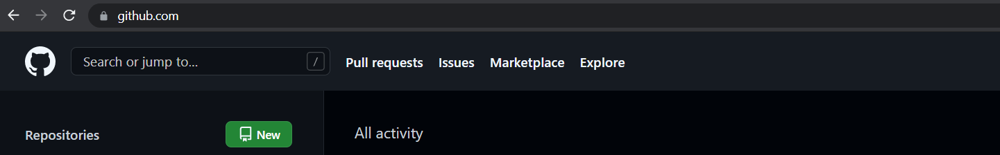

# Git Introduction :

### What is Git ?

* open Source version control System.[Do not search about more this you will learn after some time automatically. ]  
* Developed by Linus Torvalds in 2005.
* Based on this some Famous online Platforms are Github, Bitbucket etc.
* Git helps developers to maintain their Projects and teams to work on same project with their own copy of project.

### How Git works ?

* In simply words suppose you have some cloud storage on online platform like Github.
* Where you will put your code. Like we do in google Drive where we store our data.(images, Excel files, doc files etc ).
* 

* Every  Folder we create on Git Platform i.e Github is know as Repository. Where we put our Project related code.
* Remote Repository equals to a Folder in Cloud Platform. 
* Local Repository equals to a Folder in your Local Laptop.
* So Git is a piece of Software which send  your Local Repository content to Remote Repository.

### What are Popular Terminology. When do we use Git ?

* $ git clone <git Repository URL>  ==>> This will download any git Remote Repository into Your Local Laptop. Now it became your Local Repository and you are free to do changes if you want. Changes will not reflect until you push your changes to Repository.
* $ git status  ==>> This command used to get status of your Local Repo changes.
* $ git add [options] ==>> This command is used to mark all your changes and make them ready to go.
* $ git commit -m "<message>"   ==>> This command is used to write a message about your changes So that you/your team can understand later.

+ $ git push ==>> This command is used to store all your Local Repository changes into Remote Repository.
+ $ git pull  ==>> If you want to update your Local Repository  with new changes which your Team has made into Repository.

### Lets Do Practical 

* If you don't have make fresh new account on Github.

* Add new Repository at left Corner. 

  

* Write any New Repository name.
* Choose Public OR Private Repository option.
* Add a README file.
* Press Create Repository Button.
* Now Your Online Folder( Git Repository ) successfully  Created.

####  Install Git on your Laptop

* [Install git for Windows](https://git-scm.com/download/win)
* [To know more about Git read its Book](https://git-scm.com/book/en/v2)

### What is Rebase ??

### What is .gitIgnore ?

### What is git branch ??

### what is git merge ??

